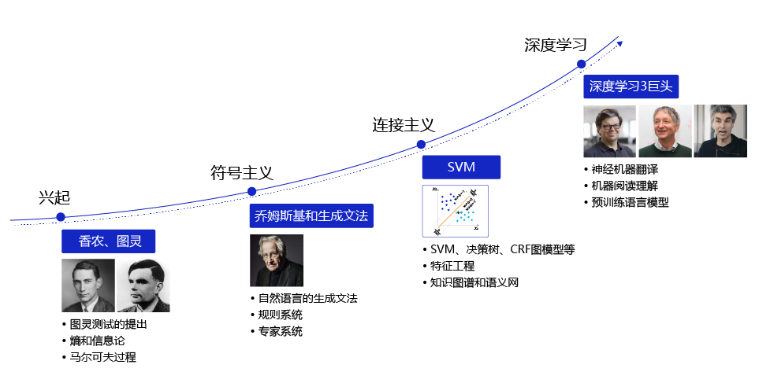
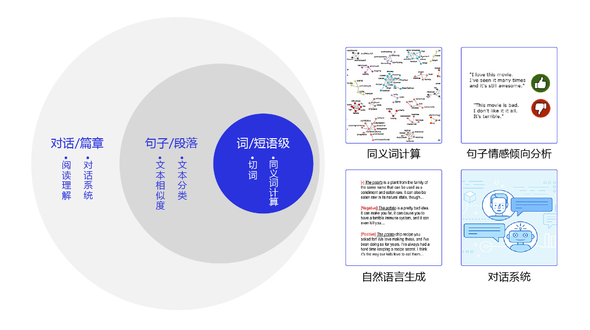

# 自然语言处理

自然语言处理（Natural Language Processing，简称NLP）被誉为人工智能皇冠上的明珠，是计算机科学和人工智能领域的一个重要方向。它主要研究人与计算机之间，使用自然语言进行有效通信的各种理论和方法。简单来说，计算机以用户的自然语言形式作为输入，在其内部通过定义的算法进行加工、计算等系列操作后（用以模拟人类对自然语言的理解），再返回用户所期望的结果，如 **图1** 所示。

图2：自然语言处理技术在各领域的应用

自然语言处理是一门融合语言学、计算机科学和数学于一体的科学。它不仅限于研究语言学，还是研究能高效实现自然语言理解和自然语言生成的计算机系统，特别是其中的软件系统，因此它是计算机科学的一部分。

随着计算机和互联网技术的发展，自然语言处理技术在各领域广泛应用，如 **图2** 所示。在过去的几个世纪，工业革命用机械解放了人类的双手，在当今的人工智能革命中，计算机将代替人工，处理大规模的自然语言信息。我们平时常用的搜索引擎，新闻推荐，智能音箱等产品，都是以自然语言处理技术为核心的互联网和人工智能产品。

图2：自然语言处理技术在各领域的应用

此外，自然语言处理技术的研究也在日新月异变化，每年投向ACL（Annual Meeting of the Association for Computational Linguistics，计算语言学年会，自然语言处理领域的顶级会议）的论文数成倍增长，自然语言处理的应用效果被不断刷新，有趣的任务和算法更是层出不穷。

本节为您简要介绍自然语言处理的发展历程、主要挑战，以及如何使用飞桨快速完成各项常见的自然语言处理任务。

### 致命密码：一场关于语言的较量

事实上，人们并非只在近代才开始研究和处理自然语言，在漫长的历史长河中，对自然语言妥当处理往往决定了战争的胜利或是政权的更迭。

16世纪的英国大陆，英格兰和苏格兰刚刚完成统一，统治者为英格兰女王伊丽莎白一世，苏格兰女王玛丽因被视为威胁而遭到囚禁。玛丽女王和其他苏格兰贵族谋反，这些贵族们通过信件与玛丽女王联络，商量营救方案并推翻伊丽莎白女王的统治。为了能更安全地与同伙沟通，玛丽使用了一种传统的文字加密形式 - 凯撒密码对她们之间的信件进行加密，如 图3 所示。

图3：凯撒密码

这种密码通过把原文中的字母替换成另外一个字符的形式，达到加密手段。然而他们的阴谋活动早在英格兰贵族监控之下，英格兰国务大臣弗朗西斯·沃尔辛厄姆爵士通过**统计英文字母的出现频率**和玛丽女王**密函中的字母频率**，找到了破解密码的规律。最终，玛丽和其他贵族在举兵谋反前夕被捕。这是近代西方第一次破译密码，开启了近现代密码学的先河。

## 自然语言处理的发展历程

自然语言处理有着悠久的发展史，可粗略地分为兴起、符号主义、连接主义和深度学习四个阶段，如 图4 所示：

图4：自然语言处理的发展历程

## 自然语言处理技术面临的挑战

如何让机器像人一样，能够准确理解和使用自然语言？这是当前自然语言处理领域面临的最大挑战。为了解决这一问题，我们需要从语言学和计算两个角度思考。

### 语言学角度

自然语言数量多、形态各异，理解自然语言对人来说本身也是一件复杂的事情，如同义词、情感倾向、歧义性、长文本处理、语言惯性表达等。通过如下几个例子，我们一同感受一下。

#### 同义词问题

请问下列词语是否为同义词？（题目来源：四川话和东北话6级模拟考试）

    瓜兮兮 和 铁憨憨
    嘎嘎 和 肉（you）
    磕搀 和 难看
    吭呲瘪肚 和 速度慢

#### 情感倾向问题

请问如何正确理解下面两个场景？

    场景一：女朋友生气了，男朋友电话道歉。
    女生：就算你买包我也不会原谅你！
    男生：宝贝，放心，我不买，你别生气了。
    问：女生会不会生气？
    
    场景二：甲和乙是同宿舍的室友，他们之间的对话。
    甲：钥匙好像没了，你把锁别别。
    乙：到底没没没？
    甲：我也不道没没没。
    乙：要没没你让我别，别别了，别秃鲁了咋整？
    问：到底别不别？

#### 歧义性问题

请问如何理解下面三句话？

    一行行行行行，一行不行行行不行。
    来到杨过曾经生活过的地方，小龙女说：“我也想过过过儿过过的生活”。
    来到儿子等校车的地方，邓超对孙俪说：“我也想等等等等等过的那辆车”。

相信大多数人都需要花点脑筋去理解上面的句子，在不同的上下文中，相同的单词可以具有不同的含义，这种问题我们称之为歧义性问题。

#### 对话/篇章等长文本处理问题

在处理长文本（如一篇新闻报道，一段多人对话，甚至于一篇长篇小说）时，需要经常处理各种省略、指代、话题转折和切换等语言学现象，给机器理解自然语言带来了挑战，如 图7 所示。

图7：多轮对话中的指代和省略

#### 探索自然语言理解的本质问题

    研表究明，汉字的顺序并不定一能影阅响读，比如当你看完这句话后，才发这现里的字全是都乱的。

上面这句话从语法角度来说完全是错的，但是对大部分人来说完全不影响理解，甚至很多人都不会意识到这句话的语法是错的。

### 计算角度

自然语言技术的发展除了受语言学的制约外，在计算角度也天然存在局限。顾名思义，计算机是计算的机器，现有的计算机都以浮点数为输入和输出，擅长执行加减乘除类计算。自然语言本身并不是浮点数，计算机为了能存储和显示自然语言，需要把自然语言中的字符转换为一个固定长度（或者变长）的二进制编码，如 图8 所示。

图8：计算机计算自然语言流程

由于这个编码本身不是数字，对这个编码的计算往往不具备数学和物理含义。例如：把“法国”和“首都”放在一起，大多数人首先联想到的内容是“巴黎”。但是如果我们使用“法国”和“首都”的UTF-8编码去做加减乘除等运算，是无法轻易获取到“巴黎”的UTF-8编码，甚至无法获得一个有效的UTF-8编码。因此，如何让计算机可以有效地计算自然语言，是计算机科学家和工程师面临的巨大挑战。

此外，目前也有研究人员正在关注自然语言处理方法中的社会问题：**包括自然语言处理模型中的偏见和歧视、大规模计算对环境和气候带来的影响、传统工作被取代后，人的失业和再就业问题等。** 

## 自然语言处理的常见任务

自然语言处理是是非常复杂的领域，是人工智能中最为困难的问题之一，常见的任务如 图9 所示：

图9：自然语言处理常见任务

**词和短语级任务**：包括切词、词性标注、命名实体识别（如“苹果很好吃”和“苹果很伟大”中的“苹果”，哪个是苹果公司？）、同义词计算（如“好吃”的同义词是什么？）等以词为研究对象的任务。

**句子和段落级任务**：包括文本倾向性分析（如客户说：“你们公司的产品真好用！”是在夸赞还是在讽刺？）、文本相似度计算（如“我坐高铁去广州”和“我坐火车去广州”是一个意思吗？）等以句子为研究对象的任务。

**对话和篇章级任务**：包括机器阅读理解（如使用医药说明书回答患者的咨询问题）、对话系统（如打造一个24小时在线的AI话务员）等复杂的自然语言处理系统等。

**自然语言生成**：如机器翻译（如“我爱飞桨”的英文是什么？）、机器写作（以AI为题目写一首诗）等自然语言生成任务。

## 使用深度学习解决自然语言处理任务的套路

使用深度学习解决自然语言处理任务一般需要经历如下几个步骤：

    （前提）学习基本知识。 在学习相关的知识后才能对任务有一定的了解，例如了解模型的网络结构、数据集的构成等，为后续解决任务打好基础。

    1. 处理数据: 确认网络能够接收的数据形式，然后对数据进行处理。
    2. 实现网络: 搭建网络的过程。
    3. 模型训练: 训练模型调整参数的过程。
    4. 评估&上线: 对训练出的模型效果进行评估，确认模型性能。
    

图10：使用飞桨框架构建神经网络过程

## 参考链接
    
    1. https://www.paddlepaddle.org.cn/tutorials/projectdetail/1516141
    