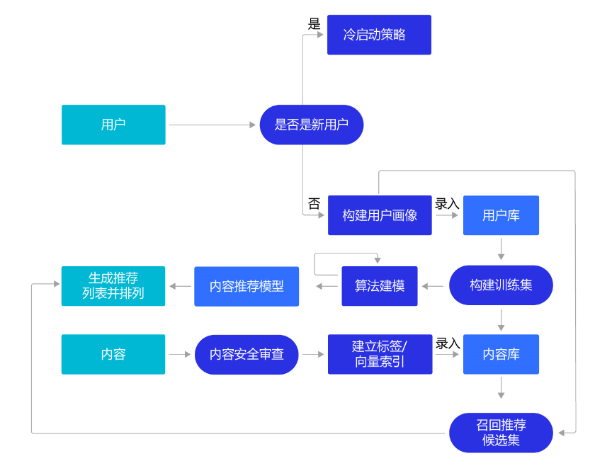

# 电影推荐系统 --- 根据用户属性 + 电影种类 + 评论推荐

## 模型设计

神经网络模型设计是电影推荐任务中重要的一环。它的作用是提取图像、文本或者语音的特征，利用这些特征完成分类、检测、文本分析等任务。在电影推荐任务中，我们将设计一个神经网络模型，提取用户数据、电影数据的特征向量，然后计算这些向量的相似度，利用相似度的大小去完成推荐。

根据第一章中对建模思路的分析，神经网络模型的设计包含如下步骤：

    1. 分别将用户、电影的多个特征数据转换成特征向量。
    2. 对这些特征向量，使用全连接层或者卷积层进一步提取特征。
    3. 将用户、电影多个数据的特征向量融合成一个向量表示，方便进行相似度计算。
    4. 计算特征之间的相似度。
    
依据这个思路，我们设计一个简单的电影推荐神经网络模型：

该网络结构包含如下内容：

1. 提取用户特征和电影特征作为神经网络的输入，其中：

    用户特征包含四个属性信息，分别是用户ID、性别、职业和年龄。
    电影特征包含三个属性信息，分别是电影ID、电影类型和电影名称。

2. 提取用户特征。使用Embedding层将用户ID映射为向量表示，输入全连接层，并对其他三个属性也做类似的处理。然后将四个属性的特征分别全连接并相加。

3. 提取电影特征。将电影ID和电影类型映射为向量表示，输入全连接层，电影名字用文本卷积神经网络得到其定长向量表示。然后将三个属性的特征表示分别全连接并相加。

4. 得到用户和电影的向量表示后，计算二者的余弦相似度。最后，用该相似度和用户真实评分的均方差作为该回归模型的损失函数。

    衡量相似度的计算有多种方式，比如计算余弦相似度、皮尔森相关系数、Jaccard相似系数等等，或者通过计算欧几里得距离、曼哈顿距离、明可夫斯基距离等方式计算相似度。
    余弦相似度是一种简单好用的向量相似度计算方式，通过计算向量之间的夹角余弦值来评估他们的相似度，本节我们使用余弦相似度计算特征之间的相似度。
    
## 为何如此设计网络呢？

网络的主体框架已经在第一章中做出了分析，但还有一些细节点没有确定。

1. 如何将“数字”转变成“向量”？

    如NLP章节的介绍，使用词嵌入（Embedding）的方式可将数字转变成向量。

2. 如何合并多个向量的信息？例如：如何将用户四个特征（ID、性别、年龄、职业）的向量合并成一个向量？

    最简单的方式是先将不同特征向量（ID 32维、性别 16维、年龄 16维、职业 16维）通过4个全连接层映射到4个等长的向量（200维度），再将4个等长的向量按位相加即可得到1个包含全部信息的向量。
    
    电影类型的特征是将多个数字（代表出现的单词）转变成的多个向量（6个），可以通过相同的方式合并成1个向量。
    
3. 如何处理文本信息？
    
    如NLP章节的介绍，使用卷积神经网络(CNN)和长短记忆神经网络（LSTM）处理文本信息会有较好的效果。**因为电影标题是相对简单的短文本，所以我们使用卷积网络结构来处理电影标题**。
    
4. 尺寸大小应该如何设计？
    
    这涉及到信息熵的理念：越丰富的信息，维度越高。所以，信息量较少的原始特征可以用更短的向量表示，例如性别、年龄和职业这三个特征向量均设置成16维，而用户ID和电影ID这样较多信息量的特征设置成32维。综合了4个原始用户特征的向量和综合了3个电影特征的向量均设计成200维度，使得它们可以蕴含更丰富的信息。当然，尺寸大小并没有一贯的最优规律，需要我们根据问题的复杂程度，训练样本量，特征的信息量等多方面信息探索出最有效的设计。 
    
## Embedding介绍

Embedding是一个嵌入层，将输入的非负整数矩阵中的每个数值，转换为具有固定长度的向量。 

在NLP任务中，一般把输入文本映射成向量表示，以便神经网络的处理。在数据处理章节，我们已经将用户和电影的特征用数字表示。嵌入层Embedding可以完成数字到向量的映射。

## 相似度计算

计算得到用户特征和电影特征后，我们还需要计算特征之间的相似度。如果一个用户对某个电影很感兴趣，并给了五分评价，那么该用户和电影特征之间的相似度是很高的。

衡量向量距离（相似度）有多种方案：欧式距离、曼哈顿距离、切比雪夫距离、余弦相似度等，

本节我们使用忽略尺度信息的**余弦相似度**构建相似度矩阵。余弦相似度又称为余弦相似性，是通过计算两个向量的夹角余弦值来评估他们的相似度，如下图，两条红色的直线表示两个向量，之间的夹角可以用来表示相似度大小，角度为0时，余弦值为1，表示完全相似。

## 从推荐案例的三点思考

1. Deep Learning is all about “Embedding Everything”。不难发现，深度学习建模是套路满满的。任何事物均用向量的方式表示，可以直接基于向量完成“分类”或“回归”任务；也可以计算多个向量之间的关系，无论这种关系是“相似性”还是“比较排序”。在深度学习兴起不久的2015年，当时AI相关的国际学术会议上，大部分论文均是将某个事物Embedding后再进行挖掘，火热的程度仿佛即使是路边一块石头，也要Embedding一下看看是否能挖掘出价值。直到近些年，能够Embedding的事物基本都发表过论文，Embeddding的方法也变得成熟，这方面的论文才逐渐有减少的趋势。

2. 在深度学习兴起之前，不同领域之间的迁移学习往往要用到很多特殊设计的算法。但深度学习兴起后，迁移学习变得尤其自然。训练模型和使用模型未必是同样的方式，中间基于Embedding的向量表示，即可实现不同任务交换信息。例如本章的推荐模型使用用户对电影的评分数据进行监督训练，训练好的特征向量可以用于计算用户与用户的相似度，以及电影与电影之间的相似度。对特征向量的使用可以极其灵活，而不局限于训练时的任务。

3. 网络调参：神经网络模型并没有一套理论上可推导的最优规则，实际中的网络设计往往是在理论和经验指导下的“探索”活动。例如推荐模型的每层网络尺寸的设计遵从了信息熵的原则，原始信息量越大对应表示的向量长度就越长。但具体每一层的向量应该有多长，往往是根据实际训练的效果进行调整。所以，建模工程师被称为数据处理工程师和调参工程师是有道理的，大量的精力花费在处理样本数据和模型调参上。

## 在工业实践中的推荐系统

本章介绍了比较简单的推荐系统构建方法，在实际应用中，验证一个推荐系统的好坏，除了预测准确度，还需要考虑多方面的因素，比如多样性、新颖性，甚至商业目标匹配度等。要实践一个好的推荐系统，值得更深入的探索研究。下面将工业实践推荐系统还需要考虑的主要问题做一个概要性的介绍。

1. **推荐来源**：推荐来源会更加多样化，除了使用深度学习模型的方式，还大量使用标签匹配的个性化推荐方式。此外，推荐热门的内容，具有时效性的内容和一定探索性的内容，都非常关键。对于新闻类的内容推荐，用户不希望地球人都在谈论的大事自己毫无所知，期望更快更全面的了解。如果用户经常使用的推荐产品总推荐“老三样”，会使得用户丧失“新鲜感”而流失。因此，除了推荐一些用户喜欢的内容之外，谨慎的推荐一些用户没表达过喜欢的内容，可探索用户更广泛的兴趣领域，以便有更多不重复的内容可以向用户推荐。

2. **检索系统**：将推荐系统构建成“召回+排序”架构的高性能检索系统，以更短的特征向量建倒排索引。在“召回＋排序”的架构下，通常会训练出两种不同长度的特征向量，使用较短的特征向量做召回系统，从海量候选中筛选出几十个可能候选。使用较短的向量做召回，性能高但不够准确，然后使用较长的特征向量做几十个候选的精细排序，因为待排序的候选很少，所以性能低一些也影响不大。

3. **冷启动问题**：现实中推荐系统往往要在产品运营的初期一起上线，但这时候系统尚没有用户行为数据的积累。这时，我们往往建立一套专家经验的规则系统，比如一个在美妆行业工作的店小二对各类女性化妆品偏好是非常了解的。通过规则系统运行一段时间积累数据后，再逐渐转向机器学习的系统。很多推荐系统也会主动向用户收集一些信息，比如大家注册一些资讯类APP时，经常会要求选择一些兴趣标签。

4. **推荐系统的评估**：推荐系统的评估不仅是计算模型Loss所能代表的，是使用推荐系统用户的综合体验。除了采用更多代表不同体验的评估指标外（准确率、召回率、覆盖率、多样性等），还会从两个方面收集数据做分析：

    （1）行为日志：如用户对推荐内容的点击率，阅读市场，发表评论，甚至消费行为等。
    （2）人工评估：选取不同的具有代表性的评估员，从兴趣相关度、内容质量、多样性、时效性等多个维度评估。如果评估员就是用户，通常是以问卷调研的方式下发和收集。

其中，多样性的指标是针对探索性目标的。而推荐的覆盖度也很重要，代表了所有的内容有多少能够被推荐系统送到用户面前。如果推荐每次只集中在少量的内容，大部分内容无法获得用户流量的话，会影响系统内容生态的健康。比如电商平台如果只推荐少量大商家的产品给用户，多数小商家无法获得购物流量，会导致平台上的商家集中度越来越高，生态不再繁荣稳定。

从上述几点可见，搭建一套实用的推荐系统，不只是一个有效的推荐模型。要从业务的需求场景出发，构建完整的推荐系统，最后再实现模型的部分。如果技术人员的视野只局限于模型本身，是无法在工业实践中搭建一套有业务价值的推荐系统的。

